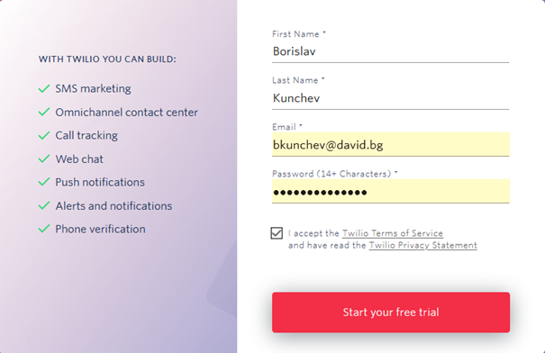
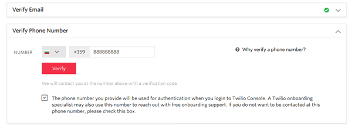
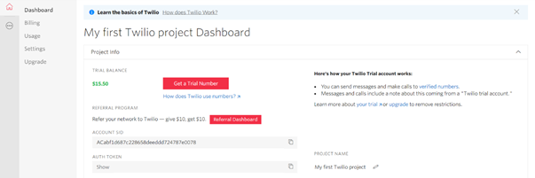
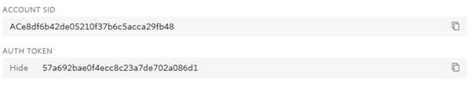

**Създаване на Twilio акаунт**

1. Отваря се сайта [www.twilio.com](http://www.twilio.com/) и се избира бутон "Sign up":

2. Попълва се формата за регистрация:

3. Получава се известие, че е трябва да се потвърди въведеният при регистрация електронен адрес. Необходимо е да се кликне върху линка в получения от Twilio e-mail.

4. Отваря се нова форма за потвърждение на телефонен номер:

5. На посоченият номер се изпраща SMS съдържащ 6 цифрен код за потвърждение.

6. След въвеждане на кода се отваря началната страница на Twilio:

7. За настройка на приложението са необходими Account SID и Auth token:

